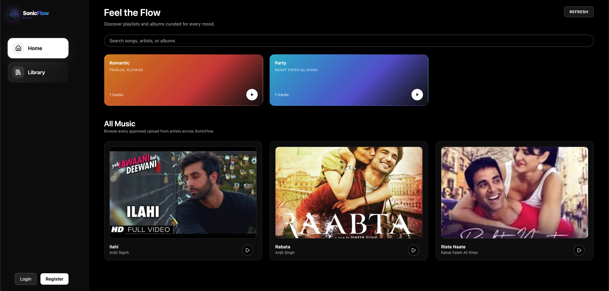
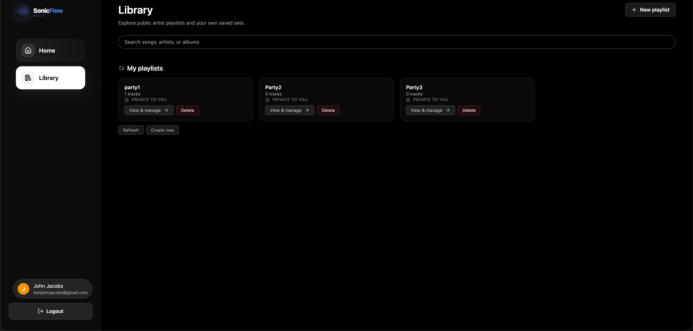
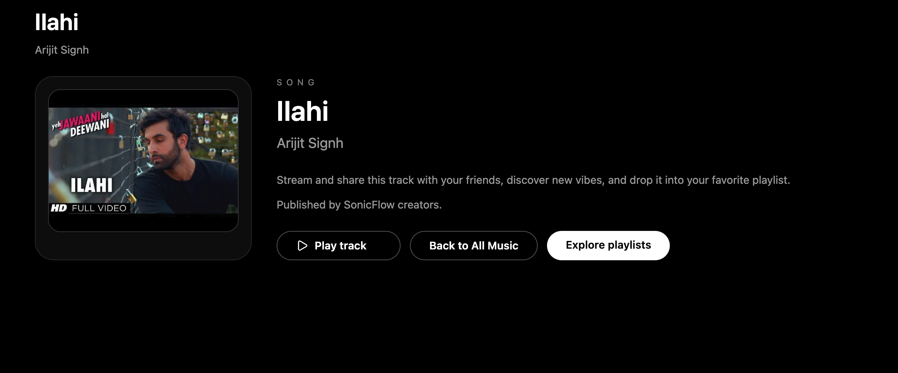
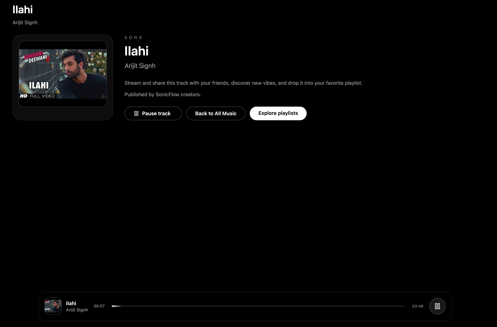
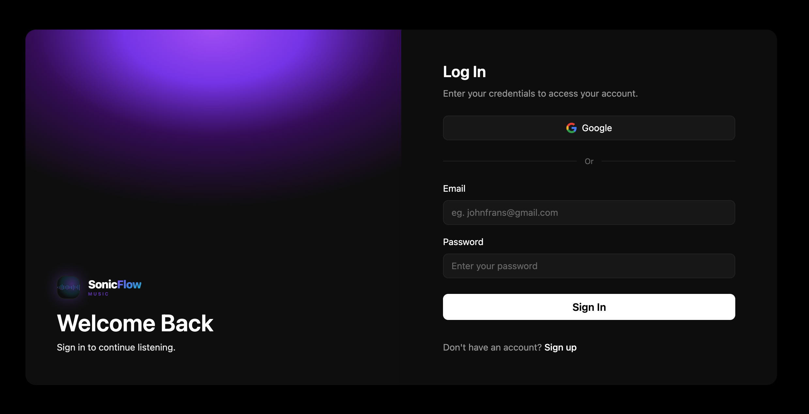
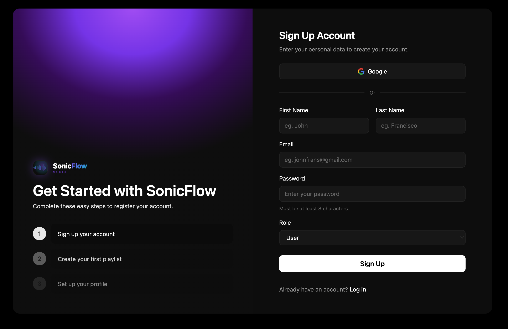

# SonicFlow

Frontend + microservices (Auth, Music) for a role-based streaming demo.

## What’s implemented

- **Auth service (port 3001)**: register/login/logout, JWT in httpOnly cookie, role (`user`/`artist`) in token.
- **Music service (port 3002)**:
  - Songs: add (artist only), list (optional `artistId` filter), get by id, delete, search.
  - Artist playlists (public): create/delete (artist), add/remove songs, list all or by id (public).
  - User playlists (private): create/delete (user), add/remove songs, list own or by id.
  - Models include `artistId` on songs and `artistName` on artist playlists.
- **Web app (Vite/React + RTK Query + Tailwind)**:
  - Home shows public artist playlists (with artist name) and all songs.
  - Library shows user playlists; artist section visible only to artists; links to manage page.
  - Playlist page (per playlist) lets owners search songs by name, add/remove, delete playlist.
  - Create playlist page: artists see only artist playlist option; users see only user option.
  - Artist dashboard: only the artist’s own songs (filtered by `artistId`).
  - Responsive sidebar; mobile header with menu + logo + logout.

## Screenshots

### Dashboard


### Library


### Song Page & Player
<p align="center">
  
  
</p>

### Authentication
<p align="center">
  
  
</p>

## Running locally

```bash
# Auth service
cd Auth
npm install
npm run dev   # uses http://localhost:3001

# Music service
cd ../Music
npm install
npm run dev   # uses http://localhost:3002

# Web (frontend)
cd ../Web
npm install
npm run dev   # Vite, uses the above base URLs
```

Env needed (set in each service):
- `JWT_SECRET`
- DB connection string
- ImageKit/asset keys for uploads

## API reference (Music)

- `POST /api/song/addSong` (artist, multipart)
- `GET /api/song/getSongs` (optional `artistId`)
- `GET /api/song/getSongById?id=...`
- `DELETE /api/song/deleteSong/:id` (artist)
- `GET /api/song/search?query=...`
- `POST /api/song/createArtistPlayList` (artist)
- `GET /api/song/getArtistPlayList` (public)
- `GET /api/song/getArtistPlayListById/:id` (public)
- `DELETE /api/song/deleteArtistPlayList/:id` (artist owner)
- `POST /api/song/addSongToArtistPlayList/:playListId` (artist owner, body `{songId}`)
- `POST /api/song/removeSongToArtistPlayList/:playListId` (artist owner, body `{songId}`)
- `POST /api/song/createUserPlayList` (user)
- `GET /api/song/getUserPlayList` (user)
- `GET /api/song/getUserPlayListById/:id` (user)
- `DELETE /api/song/deleteUserPlayList/:id` (user owner)
- `POST /api/song/addSongToUserPlayList/:playListId` (user owner, body `{songId}`)
- `POST /api/song/removeSongToUserPlayList/:playListId` (user owner, body `{songId}`)

## What we built/fixed

- Role-aware auth with JWT cookies and artist/user separation.
- Song uploads store `artistId`; artist dashboards only show their own songs.
- Public artist playlists now carry `artistName`; shown on Home with gradients.
- Playlist management page for both user/artist: search by name, add/remove songs, delete playlist.
- Library: artist section visible only to artists; user section for private playlists.
- Sidebar/header responsive tweaks; mobile hides profile bubble.
- Duplicate playlist adds return a friendly message; status toasts auto-clear.
- Artist playlist add/remove/delete ownership checks corrected; ID comparisons fixed.

## Deployment checklist

- Set prod base URLs in `Web/src/services/authApi.js` and `songApi.js`.
- Enable CORS and secure cookies (sameSite=None, secure) for your domain.
- Ensure storage credentials for cover/audio uploads.
- Run `npm run build` for Web; start Auth and Music with a process manager.
- Seed at least one artist account and verify add/remove/delete playlist flows. 
