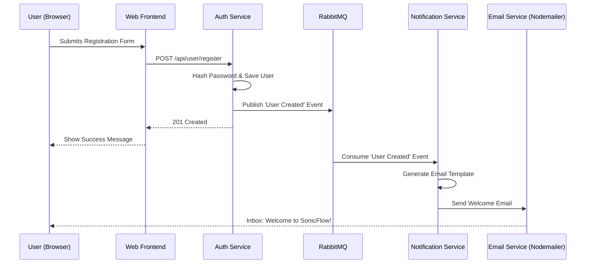
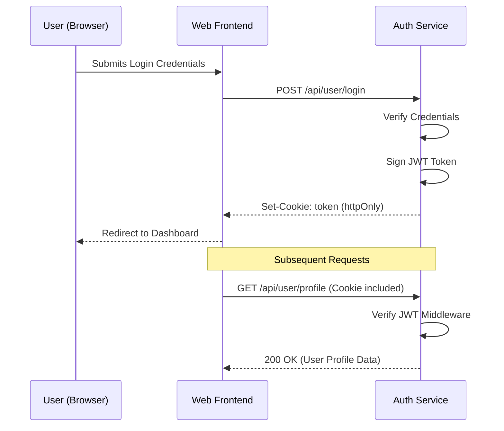
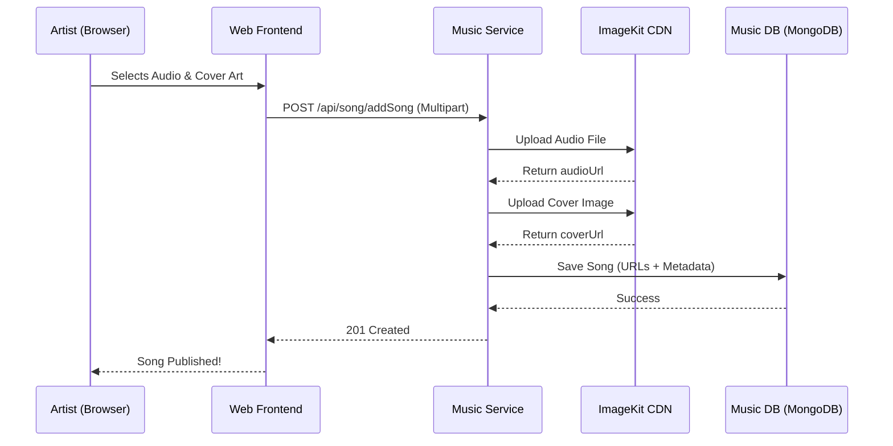
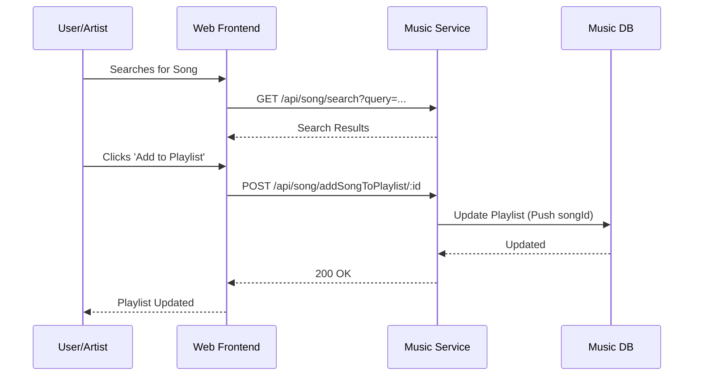

# SonicFlow Application Flows

This document details the key operational flows within the SonicFlow microservices ecosystem using Mermaid sequence diagrams.

## 1. User Registration & Onboarding Flow
This flow illustrates the asynchronous notification process triggered upon user registration.

---

## 2. Authentication & Session Flow
SonicFlow uses JWTs stored in `httpOnly` cookies for secure session management.

---

## 3. Artist Song Upload Flow
How artists contribute music to the platform.

---

## 4. Playlist Management Flow
Interaction for adding songs to a user or artist playlist.

