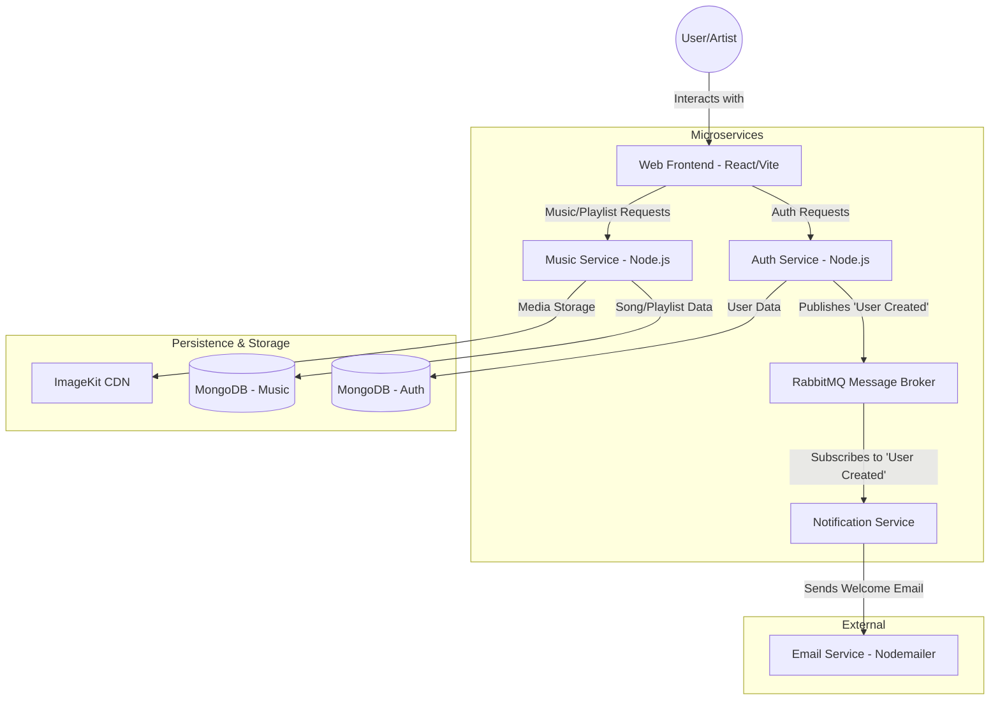

# SonicFlow Project Walkthrough

SonicFlow is a modern, microservices-based music streaming platform that allows users to listen to music and artists to upload and manage their content. This document provides a comprehensive overview of the system's architecture, components, and key workflows.

## 🏗️ System Architecture

The following architecture diagram illustrates the high-level interaction between components. For detailed sequence diagrams of specific operations (Registration, Login, Upload), see [flow.md](file:///c:/Users/pranj/OneDrive/Desktop/SonicFlow/flow.md).

## 🗺️ System Flow

---

## 🛠️ Components Breakdown

### 1. Web Frontend (`/Web`)
Built using **React** and **Vite**, the frontend provides a responsive and intuitive user interface.
- **State Management**: Uses **Redux Toolkit** and **RTK Query** for efficient data fetching and caching.
- **Styling**: **Tailwind CSS** for modern, responsive designs.
- **Key Features**:
  - Role-based navigation (Artist vs. User).
  - Dynamic Music Player with volume and progress control.
  - Playlist management (Search, Add, Remove, Delete).
  - Responsive sidebar and mobile-friendly header.

### 2. Auth Service (`/Auth`)
Responsible for user identity and access management.
- **Tech Stack**: Node.js, Express, Mongoose, JWT.
- **Functionality**: 
  - User/Artist registration and login.
  - JWT issued in `httpOnly` cookies for security.
  - Role-based access control (User/Artist).
  - **Inter-service Communication**: Publishes a message to RabbitMQ when a new user registers.

### 3. Music Service (`/Music`)
The core service handling all music-related operations.
- **Tech Stack**: Node.js, Express, Mongoose, Multer, ImageKit SDK.
- **Functionality**:
  - **Songs**: Upload (Artists only), search, and retrieval.
  - **Playlists**: 
    - **Artist Playlists**: Publicly visible, created and managed by artists.
    - **User Playlists**: Private, created and managed by individual users.
  - **Media Management**: Uses **ImageKit** for storing and serving audio files and cover images.

### 4. Notification Service (`/Notification`)
A background service that handles asynchronous tasks.
- **Tech Stack**: Node.js, RabbitMQ (amqplib), Nodemailer.
- **Functionality**:
  - Listens for "User Created" events from RabbitMQ.
  - Sends a professionally styled welcome email to new users.

---

## 🔄 Key Workflows

### 1. User Registration & Onboarding
1. User submits the registration form on the **Web Frontend**.
2. **Auth Service** creates the user in **AuthDB**.
3. **Auth Service** publishes a "User Created" message to **RabbitMQ**.
4. **Notification Service** picks up the message and sends a "Welcome" email via **Email Service**.
5. User is redirected to login.

### 2. Artist Song Upload
1. Artist selects an audio file and cover image in the **Web Frontend**.
2. **Web Frontend** sends a multipart/form-data request to the **Music Service**.
3. **Music Service** uploads files to **ImageKit**.
4. **Music Service** saves the song metadata (including ImageKit URLs and `artistId`) to **MusicDB**.
5. The new song appears on the Artist's dashboard and the global Home page.

### 3. Playlist Management
1. Users or Artists can create playlists via the **Web Frontend**.
2. **Music Service** distinguishes between `UserPlayList` (private) and `ArtistPlayList` (public).
3. Owners can search for songs by name and add/remove them from their playlists.
4. Changes are persisted in the **MusicDB**.

---

## 🗄️ Database Schema (Music)

### Song
- `title`: String
- `artistId`: ObjectId (Refers to User in Auth)
- `audioUrl`: String (ImageKit)
- `coverUrl`: String (ImageKit)
- `duration`: Number

### ArtistPlayList (Public)
- `name`: String
- `artistId`: ObjectId
- `artistName`: String
- `songs`: Array of Song ObjectIds

### UserPlayList (Private)
- `name`: String
- `userId`: ObjectId
- `songs`: Array of Song ObjectIds

---

## 🚀 Tech Stack Summary

| Layer | Technology |
| :--- | :--- |
| **Frontend** | React, Vite, Redux Toolkit (RTK Query), Tailwind CSS |
| **Backend** | Node.js, Express |
| **Databases** | MongoDB (Mongoose) |
| **Messaging** | RabbitMQ |
| **Storage** | ImageKit |
| **Auth** | JWT (httpOnly Cookies) |
| **Communication** | Nodemailer |
